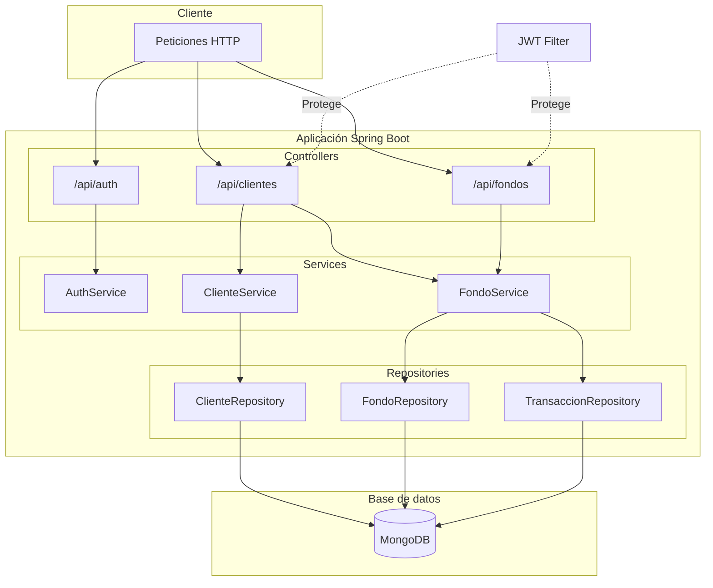
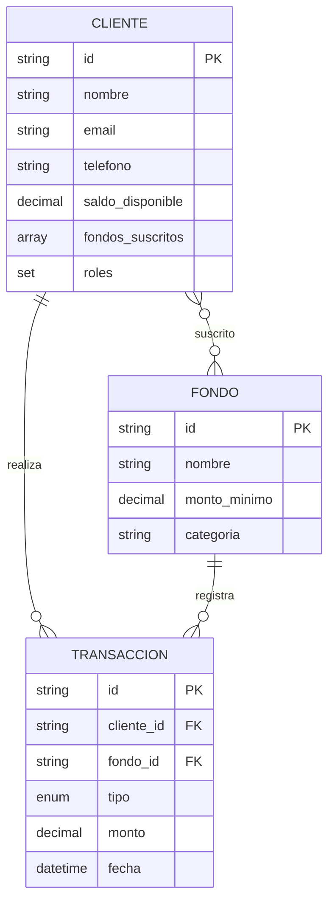
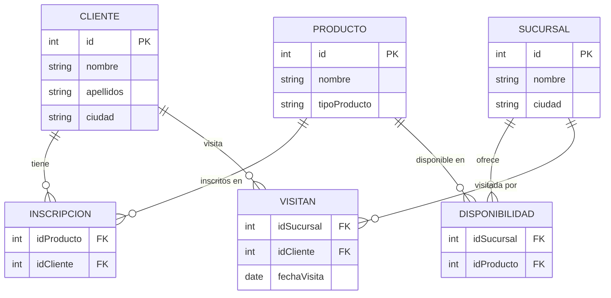

# Prueba Técnica SETI - Backend

API REST para la gestión de fondos de inversión. Este proyecto está dividido en dos partes según la especificación técnica (`prueba_tecnica_back_end 4.pdf`).

Los requisitos y endpoints están definidos en el documento técnico y en la colección Postman incluida en el repositorio.

## Contenido

- [Base de datos (opcional)](#base-de-datos-opcional)
- [Requisitos previos](#requisitos-previos)
- [Parte 1 - API Fondos](#parte-1---api-fondos)
- [Parte 2 - Consulta SQL](#parte-2---consulta-sql)
- [Puesta en marcha](#puesta-en-marcha)
- [Estructura del proyecto](#estructura-del-proyecto)

---

## Base de datos (opcional)

> [!NOTE]
> El `docker-compose.yml` es **opcional** y sirve para **ambas partes**. Solo es necesario si no tienes MongoDB ni PostgreSQL instalados localmente. Si ya los tienes configurados, omite este paso.
>
> - **Parte 1:** MongoDB en `localhost:27017` (usuario: `btg_siti`, contraseña: `siti123`, base: `btg_fondos`)
> - **Parte 2:** PostgreSQL en `localhost:5432` (usuario: `admin`, contraseña: `admin123`, base: `btg`)

```bash
docker-compose up -d
```

---

## Requisitos previos

- Java 17+
- Maven 3.6+ (o Maven Wrapper `./mvnw`)
- MongoDB (local o remoto) — Parte 1
- PostgreSQL (local o remoto) — Parte 2

---

## Parte 1 - API Fondos

### Descripción

Sistema de gestión de fondos de inversión:

| Funcionalidad | Descripción |
|---------------|-------------|
| Autenticación | Login con JWT (email y contraseña) |
| Clientes | Registro con saldo inicial de $500.000 COP |
| Fondos | Suscripción y cancelación a fondos de inversión |
| Transacciones | Historial de operaciones por cliente |

**Stack:** Java 17 · Spring Boot 3.4.3 · MongoDB 6 · Maven

### Arquitectura



### Modelo de datos



### Solución Parte 1

**Probar la API:** Crear cliente → Login → Suscribir a fondo

- **Swagger UI:** http://localhost:8080/
- **Postman:** Importar `BTG Fondos API.postman_collection.json`

**Endpoints:**

| Método | Endpoint | Descripción | Auth |
|--------|----------|-------------|------|
| POST | `/api/auth/login` | Login (retorna JWT) | No |
| POST | `/api/clientes/` | Crear cliente | No |
| POST | `/api/fondos/suscribir` | Suscribirse a fondo | JWT |
| POST | `/api/fondos/cancelar` | Cancelar suscripción | JWT |
| GET | `/api/clientes/{id}/transacciones` | Historial de transacciones | JWT |

> [!TIP]
> Endpoints protegidos: `Authorization: Bearer <token>`

**Fondos disponibles:** 1-5 (FPV_BTG_PACTUAL_RECAUDADORA, FPV_BTG_PACTUAL_ECOPETROL, DEUDAPRIVADA, FDO-ACCIONES, FPV_BTG_PACTUAL_DINAMICA)

---

## Parte 2 - Consulta SQL

### Descripción

Consulta SQL para obtener clientes inscritos en productos que solo están disponibles en una sucursal y que visitan esa sucursal.

### Modelo de datos



### Solución Parte 2

> [!IMPORTANT]
> **Ejecutar el archivo SQL primero** para crear el esquema y cargar los datos (`parte-2-schema-data.sql`).

**Con Docker Compose:**
```bash
docker exec -i postgres_db psql -U admin -d btg < parte-2-schema-data.sql
```

**Con PostgreSQL local:**
```bash
psql -U admin -d btg -h localhost -f parte-2-schema-data.sql
```

O desde pgAdmin/DBeaver: ejecutar el contenido de `parte-2-schema-data.sql` en la base `btg`.

**Consulta SQL:**

```sql
SELECT DISTINCT C.nombre
FROM cliente AS C
JOIN inscripcion AS i ON c.id = i.idCliente
JOIN disponibilidad AS d ON i.idProducto = d.idProducto
JOIN visitan AS v ON v.idSucursal = d.idSucursal AND v.idCliente = c.id
WHERE i.idProducto IN (
    SELECT idProducto
    FROM disponibilidad
    GROUP BY idProducto
    HAVING COUNT(idSucursal) = 1
);
```

---

## Puesta en marcha

### Parte 1 — Ejecutar aplicación

```bash
./mvnw clean install
./mvnw spring-boot:run
```

Aplicación en `http://localhost:8080`

### Parte 1 — Tests

```bash
./mvnw test
```

### Parte 2 — Ejecutar esquema SQL

Ver comandos en [Solución Parte 2](#solución-parte-2).

---

## Estructura del proyecto

```
src/main/java/com/btg/prueba_tecnica_seti/
├── config/         # Security, MongoDB, OpenAPI
├── controller/     # REST (Auth, Cliente, Fondo)
├── dto/            # Request/Response
├── entity/         # Cliente, Fondo, Transaccion
├── repository/     # Spring Data MongoDB
├── security/       # JWT
└── service/impl/   # Lógica de negocio
```

---

## Notas

> [!NOTE]
> - Se inicializan **5 fondos predefinidos** automáticamente al arrancar.
> - El saldo inicial de cada nuevo cliente es de **$500.000 COP**.
