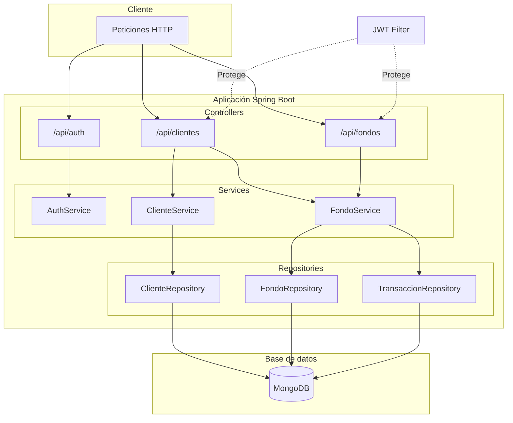
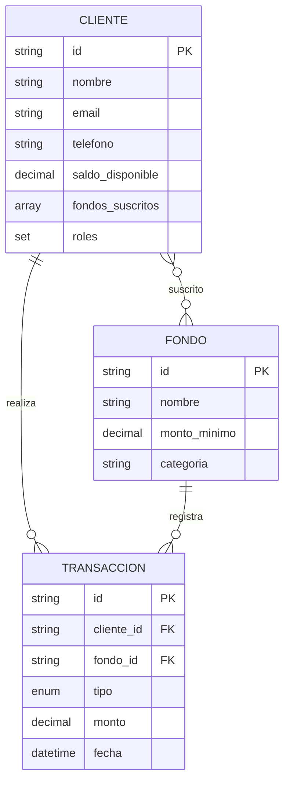
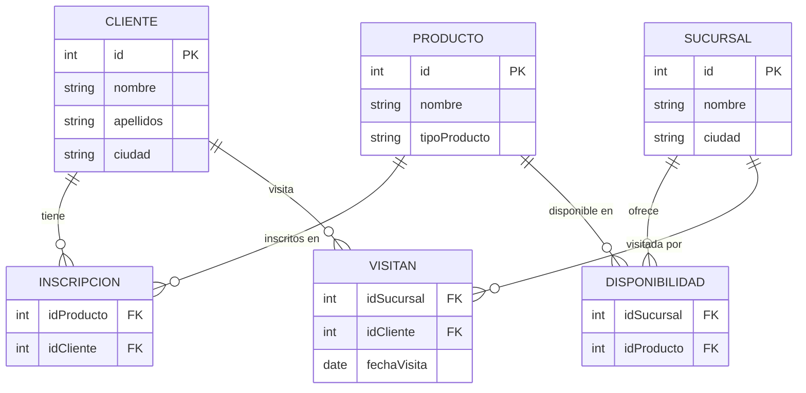

# Prueba Técnica SETI - Backend

API REST para la gestión de fondos de inversión. Este proyecto está dividido en dos partes según la especificación técnica (`prueba_tecnica_back_end 4.pdf`).

Los requisitos y endpoints están en ese documento y en la colección Postman (`BTG Fondos API.postman_collection.json`). La **Puesta en marcha** usa **Docker Compose** para MongoDB y PostgreSQL; la API Spring Boot se ejecuta en tu máquina contra esos servicios en `localhost`.

## Contenido

- [Puesta en marcha](#puesta-en-marcha) — lo primero: entorno, API, tests y SQL Parte 2
- [Parte 1 - API Fondos](#parte-1---api-fondos) — arquitectura, modelo y detalle de la sol API
- [Parte 2 - Consulta SQL](#parte-2---consulta-sql) — modelo relacional, scripts y consulta
- [Configuración (Twilio, Email)](#configuración-twilio-email)
- [Estructura del proyecto](#estructura-del-proyecto)
- [Notas](#notas)

---

## Puesta en marcha

Aquí va lo necesario para **dejar el proyecto funcionando** antes de entrar al detalle de cada parte.

### Requisitos previos

- **Java 17+** y **Maven** (o `./mvnw`)
- **Docker** y **Docker Compose** v2 (comando `docker compose`) para las bases de datos del proyecto

### Bases de datos (Docker Compose)

Este README asume que **MongoDB** y **PostgreSQL** los levantas con el `docker-compose.yml` de la raíz. En tu máquina quedan expuestos así:

| Servicio   | Puerto | Usuario / contraseña | Base        |
|------------|--------|----------------------|-------------|
| MongoDB    | `27017` | `btg_siti` / `siti123` | `btg_fondos` |
| PostgreSQL | `5432`  | `admin` / `admin123`  | `btg`       |

```bash
docker compose up -d
```

*(Si tu instalación solo tiene el binario clásico, usa `docker-compose up -d`.)*

### Parte 1 — Compilar y ejecutar la API

Con **MongoDB** en marcha (tras `docker compose up -d`):

```bash
./mvnw clean install
./mvnw spring-boot:run
```

- **Aplicación:** http://localhost:8080  
- **Swagger UI:** http://localhost:8080/  
- **Postman:** importar `BTG Fondos API.postman_collection.json`  
- **Flujo sugerido:** crear cliente → login → suscribir a fondo (con JWT en `Authorization: Bearer <token>`).

### Parte 1 — Tests

```bash
./mvnw test
```

### Scripts SQL Parte 2

Carpeta: `parte-2-sql/`. Con el **compose del repo**, la base **`btg`** ya existe; **no ejecutes** `01-create-database.sql` salvo que montes PostgreSQL fuera de este Docker.

**Orden de los scripts** (base **`btg`**, tablas en **`public`**):

| Paso | Archivo | Rol |
|------|---------|-----|
| 1 | `02-schema.sql` | Elimina el schema `btg` antiguo si existía y trabaja en `public`. |
| 2 | `03-ddl-tablas.sql` | Tablas y claves foráneas. |
| 3 | `04-constantes.sql` | `CHECK` de `tipoProducto` y comentarios. |
| 4 | `05-datos-semilla.sql` | Datos de prueba. |

**Cargar scripts con Docker** (desde la **raíz del repo**, sin entrar al contenedor):

1. Ejecuta:

```bash
cat parte-2-sql/02-schema.sql \
    parte-2-sql/03-ddl-tablas.sql \
    parte-2-sql/04-constantes.sql \
    parte-2-sql/05-datos-semilla.sql \
  | docker exec -i postgres_db psql -U admin -d btg -v ON_ERROR_STOP=1
```
---

## Parte 1 - API Fondos

### Descripción

| Funcionalidad | Descripción |
|---------------|-------------|
| Autenticación | Login con JWT (email y contraseña) |
| Clientes | Registro con saldo inicial de $500.000 COP |
| Fondos | Suscripción y cancelación a fondos de inversión |
| Transacciones | Historial de operaciones por cliente |

**Stack:** Java 17 · Spring Boot 3.4.3 · MongoDB 6 · Maven

### Arquitectura



### Modelo de datos



### Justificación de arquitectura

#### ¿Por qué MongoDB (NoSQL)?

El dominio de fondos de inversión tiene un perfil de datos que encaja naturalmente con un modelo de documentos:

- **Lista de fondos suscritos embebida en el cliente**: en un modelo relacional requeriría una tabla intermedia y un JOIN en cada operación; en MongoDB es simplemente un array dentro del documento `Cliente`, lo que hace la lectura y escritura de suscripciones muy eficiente.
- **Esquema flexible**: los fondos pueden añadir atributos (condiciones especiales, categorías nuevas) sin necesidad de migraciones de esquema.
- **Escalabilidad horizontal**: MongoDB escala horizontalmente de forma nativa, algo importante si la plataforma crece en volumen de clientes y transacciones.

#### ¿Por qué arquitectura en capas (Controller → Service → Repository)?

Se adoptó la arquitectura en capas estándar de Spring Boot por tres razones:

1. **Separación de responsabilidades**: el controller solo maneja HTTP (deserialización, validación de entrada, códigos de respuesta); el service contiene toda la lógica de negocio (reglas de saldo, suscripciones, notificaciones); el repository abstrae la persistencia. Cada capa puede evolucionar de forma independiente.
2. **Testeabilidad**: los services se pueden testear con Mockito sin levantar el servidor ni la base de datos; los controllers se pueden testear con MockMvc sin depender de la lógica de negocio real.
3. **Mantenibilidad**: cualquier desarrollador nuevo reconoce inmediatamente la estructura del proyecto, lo que reduce el tiempo de onboarding.

#### ¿Por qué JWT stateless?

- **Sin estado en servidor**: no se necesita almacén de sesiones (Redis, base de datos de sesiones), lo que simplifica el despliegue y el escalado horizontal.
- **Portabilidad**: el token viaja en el header `Authorization: Bearer <token>`, lo que facilita el consumo desde cualquier cliente (web, móvil, Postman).
- **Claims embebidos**: el `clienteId`, el `email` y los `roles` viajan dentro del token, evitando una consulta a base de datos en cada petición para resolver el usuario autenticado.

#### ¿Por qué BCrypt para contraseñas?

BCrypt es el estándar de la industria para hashing de contraseñas porque incluye un `salt` automático (evita ataques de rainbow table) y su factor de coste ajustable hace que el hash sea deliberadamente lento, lo que dificulta los ataques de fuerza bruta incluso si la base de datos es comprometida.

#### ¿Por qué Spring Boot en lugar de Python/FastAPI o .NET 9?

El documento sugiere FastAPI (Python) o .NET 9 como opciones deseables. Se optó por **Spring Boot** dado que:

- Es el framework Java empresarial más utilizado en el ecosistema BTG Pactual / banca colombiana.
- El ecosistema Spring (Security, Data MongoDB, Mail, Validation, OpenAPI) cubre todos los requisitos del problema con librerías maduras y ampliamente documentadas.
- Spring Boot 3 con Java 17 tiene soporte LTS, lo que es relevante para entornos productivos.

#### Modelo de datos — decisiones de diseño

| Decisión | Alternativa descartada | Razón |
|---|---|---|
| `fondosSuscritos` como array en `Cliente` | Colección separada de suscripciones | Lecturas más rápidas; la suscripción es parte del estado del cliente |
| `Transaccion` como colección independiente | Subdocumento en `Cliente` | El historial puede crecer indefinidamente; colección separada permite consultas eficientes con índices |
| IDs de fondo como `String` "1"–"5" | ObjectId generado por MongoDB | Permite referenciar los fondos predefinidos con IDs predecibles desde el cliente |

---

### Solución Parte 1 (detalle)

Los comandos para levantar la API y los tests están en [Puesta en marcha](#puesta-en-marcha).

**Endpoints:**

| Método | Endpoint | Descripción | Auth |
|--------|----------|-------------|------|
| POST | `/api/auth/login` | Login (retorna JWT) | No |
| POST | `/api/clientes/` | Crear cliente | No |
| POST | `/api/fondos/suscribir` | Suscribirse a fondo | JWT |
| POST | `/api/fondos/cancelar` | Cancelar suscripción | JWT |
| GET | `/api/clientes/{id}/transacciones` | Historial de transacciones | JWT |

> [!TIP]
> Endpoints protegidos: `Authorization: Bearer <token>`

**Fondos disponibles:**

| ID | Nombre | Monto mínimo | Categoría |
|----|--------|--------------|-----------|
| 1 | FPV_BTG_PACTUAL_RECAUDADORA | $75.000 COP | FPV |
| 2 | FPV_BTG_PACTUAL_ECOPETROL | $125.000 COP | FPV |
| 3 | DEUDAPRIVADA | $50.000 COP | FIC |
| 4 | FDO-ACCIONES | $250.000 COP | FIC |
| 5 | FPV_BTG_PACTUAL_DINAMICA | $100.000 COP | FPV |

---

## Parte 2 - Consulta SQL

### Descripción

Consulta SQL para obtener clientes inscritos en productos que solo están disponibles en una sucursal y que visitan esa sucursal.

La **carga del esquema y los datos** está descrita paso a paso en [Scripts SQL Parte 2](#scripts-sql-parte-2) (dentro de Puesta en marcha).

### Modelo de datos



### Scripts (`parte-2-sql/`)

| Archivo | Contenido |
|---------|-----------|
| `01-create-database.sql` | Creación manual de la base `btg` (con el compose del proyecto **no se usa**; el contenedor ya crea la base) |
| `02-schema.sql` | Alinea la sesión al schema **`public`** y elimina el schema `btg` si existía (versión antigua) |
| `03-ddl-tablas.sql` | Tablas y relaciones (PK/FK) |
| `04-constantes.sql` | Restricciones de dominio (`CHECK` sobre `tipoProducto`) y comentarios |
| `05-datos-semilla.sql` | Datos de prueba |
| `06-consulta.sql` | Consulta principal: clientes con productos disponibles solo en sucursales que visitan |

### Consulta SQL

Archivo: `parte-2-sql/06-consulta.sql`. Tablas en el schema **`public`** de la base **`btg`**.

**Requerimiento:** obtener los nombres de los clientes que tienen inscrito algún producto disponible **solo en las sucursales que visitan** — es decir, para el producto inscrito no debe existir ninguna sucursal donde esté disponible que el cliente no haya visitado (puede ser 1 sucursal o varias, siempre que el cliente las visite todas).

```sql
SELECT DISTINCT c.nombre
FROM cliente c
JOIN inscripcion i ON c.id = i.idCliente
WHERE NOT EXISTS (
    SELECT 1
    FROM disponibilidad d
    WHERE d.idProducto = i.idProducto
      AND NOT EXISTS (
          SELECT 1
          FROM visitan v
          WHERE v.idSucursal = d.idSucursal
            AND v.idCliente = c.id
      )
);
```

**Resultado con los datos de prueba:**

| Cliente |
|---------|
| Juan Carlos |
| Ana Isabel |
| Luis Fernando |
| Roberto |
| Diego |

---

## Configuración (Twilio, Email)

Las notificaciones de suscripción a fondos se envían por **Email** (SMTP) o **SMS** (Twilio) según la preferencia del cliente. Configurar en `application.properties`.

### Variables Twilio (SMS)

Obtén las credenciales en [Twilio Console](https://www.twilio.com/console):

| Variable | Descripción | Ejemplo |
|----------|-------------|---------|
| `twilio.account-sid` | Account SID de tu cuenta Twilio | `ACxxxxxxxxxxxxxxxxxxxxxxxxxxxxxxxx` |
| `twilio.auth-token` | Auth Token de tu cuenta Twilio | `your_auth_token` |
| `twilio.phone-number` | Número Twilio con capacidad SMS (formato E.164) | `+573001234567` |
| `twilio.country-code` | Código de país para números sin prefijo (opcional, default: 57) | `57` |

```properties
# SMS config Twilio
twilio.account-sid=ACxxxxxxxxxxxxxxxxxxxxxxxxxxxxxxxx
twilio.auth-token=your_auth_token
twilio.phone-number=+573001234567
twilio.country-code=57
```

> [!NOTE]
> El número de teléfono del cliente se formatea automáticamente a E.164. Si el número no incluye el prefijo `+`, se agregará `twilio.country-code` (ej: `3001234567` → `+573001234567`).

---

## Estructura del proyecto

```
parte-2-sql/              # Parte 2: SQL para PostgreSQL en Docker (base btg, schema public)

src/main/java/com/btg/prueba_tecnica_seti/
├── config/         # Security, MongoDB, OpenAPI
├── controller/     # REST (Auth, Cliente, Fondo)
├── dto/            # Request/Response
├── entity/         # Cliente, Fondo, Transaccion
├── repository/     # Spring Data MongoDB
├── security/       # JWT
└── service/impl/   # Lógica de negocio
```

---

## Notas

> [!NOTE]
> - `application.properties` apunta a MongoDB y PostgreSQL en **`localhost`** con las credenciales del `docker-compose.yml`; al usar ese compose, no hace falta cambiarlas.
> - Se inicializan **5 fondos predefinidos** al arrancar la API.
> - Saldo inicial de cada cliente: **$500.000 COP**.
> - Notificaciones de suscripción: **Email** (SMTP) y **SMS** (Twilio); revisar [Configuración](#configuración-twilio-email).
