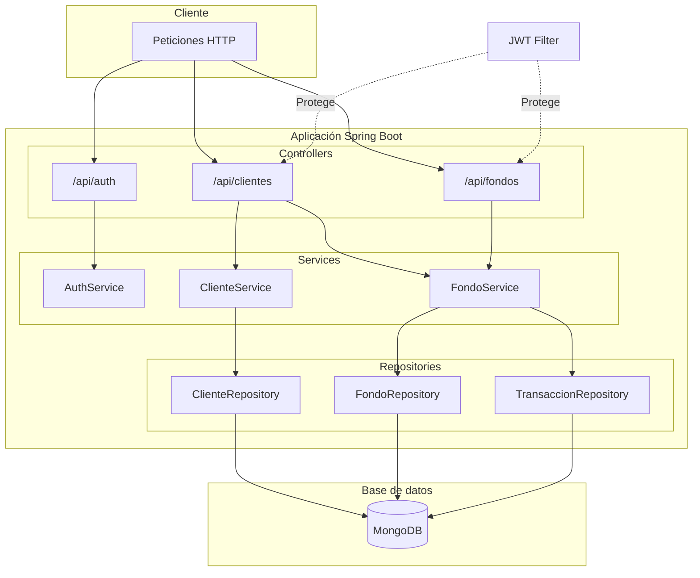
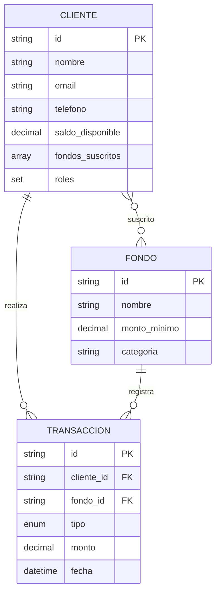

# Prueba Técnica SETI - Backend

API REST para la gestión de fondos de inversión. Este proyecto está dividido en dos partes según la especificación técnica. **Esta documentación cubre únicamente la Parte 1.**

## Contenido

- [Descripción](#descripción)
- [Arquitectura](#arquitectura)
- [Requisitos y ejecución](#requisitos-y-ejecución)
- [API](#api)
- [Estructura del proyecto](#estructura-del-proyecto)

---

## Descripción

La **Parte 1** implementa un sistema de gestión de fondos de inversión:

| Funcionalidad | Descripción |
|---------------|-------------|
| Autenticación | Login con JWT (email y contraseña) |
| Clientes | Registro con saldo inicial de $500.000 COP |
| Fondos | Suscripción y cancelación a fondos de inversión |
| Transacciones | Historial de operaciones por cliente |

**Stack:** Java 17 · Spring Boot 3.4.3 · MongoDB 6 · Maven

---

## Arquitectura

### Diagrama de arquitectura



### Modelo de datos



---

## Requisitos y ejecución

### Requisitos

- Java 17+
- Maven 3.6+
- MongoDB (local o remoto)

### Base de datos (opcional)

> [!NOTE]
> El `docker-compose.yml` es **opcional**. Solo es necesario si no tienes MongoDB instalado localmente. Si ya lo tienes configurado en tu computadora, puedes omitir este paso y ajustar las credenciales en `application.properties`.

```bash
docker-compose up -d
```

MongoDB quedará en `localhost:27017` (usuario: `btg_siti`, contraseña: `siti123`, base: `btg_fondos`).

### Ejecución

```bash
mvn clean install
mvn spring-boot:run
```

Aplicación disponible en `http://localhost:8080`.

### Tests

```bash
mvn test
```

El proyecto incluye tests unitarios (services) y de integración (controllers).

### Flujo de prueba rápida

> [!TIP]
> Para validar la solución rápidamente, sigue estos pasos en orden:

1. `docker-compose up -d` (si no tienes MongoDB)
2. `mvn spring-boot:run`
3. Abrir Swagger: http://localhost:8080/
4. Crear cliente → Login → Suscribir a fondo (usar el JWT en endpoints protegidos)

---

## API

### Documentación interactiva

> [!TIP]
> Usa **Swagger UI** para probar la API de forma interactiva sin necesidad de Postman o curl.

- **Swagger UI:** http://localhost:8080/
- **OpenAPI:** http://localhost:8080/v3/api-docs

### Endpoints (Parte 1)

| Método | Endpoint | Descripción | Auth |
|--------|----------|-------------|------|
| POST | `/api/auth/login` | Login (retorna JWT) | No |
| POST | `/api/clientes/` | Crear cliente | No |
| POST | `/api/fondos/suscribir` | Suscribirse a fondo | JWT |
| POST | `/api/fondos/cancelar` | Cancelar suscripción | JWT |
| GET | `/api/clientes/{id}/transacciones` | Historial de transacciones | JWT |

### Uso del JWT

> [!TIP]
> Para endpoints protegidos, incluye el token en el header `Authorization`:

```
Authorization: Bearer <tu_token_jwt>
```

### Roles

- **CLIENTE:** Solo puede acceder a sus propios datos.
- **ADMIN:** Acceso completo.

---

## Estructura del proyecto

```
src/main/java/com/btg/prueba_tecnica_seti/
├── config/         # Security, MongoDB, OpenAPI
├── controller/     # REST (Auth, Cliente, Fondo)
├── dto/            # Request/Response
├── entity/         # Cliente, Fondo, Transaccion
├── repository/     # Spring Data MongoDB
├── security/       # JWT
└── service/impl/   # Lógica de negocio
```

## Notas

> [!NOTE]
> - Se inicializan **5 fondos predefinidos** automáticamente al arrancar la aplicación.
> - El saldo inicial de cada nuevo cliente es de **$500.000 COP**.
